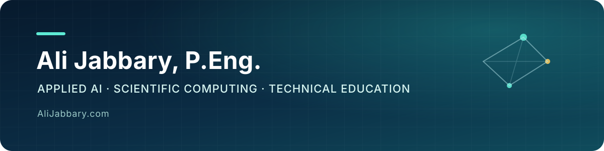

  

  
  
  
  

## Hello, I'm Ali

I hold an M.Sc. in Mechanical Engineering and build practical **AI, machine-learning, scientific-computing, and learning systems**.

My work sits at the intersection of engineering depth and clear teaching: I develop auditable technical tools, translate difficult ideas into usable mental models, and help people move from tutorials to work they can explain and defend.

Through [AliJabbary.com](https://alijabbary.com), I work with students, professionals, research teams, and organizations on:

- one-to-one Python, data science, machine-learning, statistics, and engineering education;
- corporate technical training and focused upskilling;
- AI automation, applied modelling, and scientific-software projects;
- research implementation, verification, and reproducible computational workflows.

**10+ years teaching · 500+ learners supported · students from beginner to PhD level**

## How I work

| Learn | Build | Verify |
| --- | --- | --- |
| Clear explanations, deliberate practice, and projects matched to the learner | Useful software with documented decisions and maintainable foundations | Baselines, tests, reproducibility, and claims that stay inside the evidence |

I care about the part after the demo: whether another person can run the work, inspect it, understand the trade-offs, and trust the result.

## Current release

### [Evidence First Agents](https://github.com/ali-kin4/evidence-first-agents)

A dependency-free Python CLI for reviewing the authority surfaces of AI-agent projects. It inventories repository instructions, Agent Skills, MCP configuration, declared tools, and approval boundaries—without calling a model, executing discovered commands, or contacting configured services.

The first release includes deterministic JSON and Markdown reports, safe/ambiguous/unsafe fixtures, 33 tests, a documented threat model, and Windows/Linux CI across Python 3.11–3.13.

[Explore the repository](https://github.com/ali-kin4/evidence-first-agents) · [Read the v0.1.0 release](https://github.com/ali-kin4/evidence-first-agents/releases/tag/v0.1.0)

## Selected work

| Project | What it demonstrates |
| --- | --- |
| [Evidence First Agents](https://github.com/ali-kin4/evidence-first-agents) | Static, deterministic checks for agent instructions, skills, MCP configuration, high-authority capabilities, and human-approval boundaries |
| [Evidence First AI](https://github.com/ali-kin4/evidence-first-ai-project) | A tested validation toolkit that connects applied-AI claims to declared runs, baselines, artifacts, thresholds, and limitations |
| [SkillGraph Tutor](https://github.com/ali-kin4/skillgraph-tutor) | An offline-first tutoring engine using concept graphs, knowledge tracing, forgetting-aware mastery, spaced repetition, and reproducible evaluation |
| [PyQuest Interactive Tutor](https://github.com/ali-kin4/py-quest-interactive-tutor) | A zero-setup, browser-based Python learning environment with Pyodide execution and automated feedback |
| [EduMaster](https://github.com/ali-kin4/edumaster-app) | A modern learning-platform interface for structured courses, practice, and learner progress |
| [AI Decision Router](https://github.com/ali-kin4/ai-decision-router) | An offline-testable framework for selecting models under quality, latency, and cost constraints |
| [NeuroForge CFD](https://github.com/ali-kin4/neuroforge-cfd) | Physics-checked neural-operator research with uncertainty estimation, residual-driven correction, and reproducible experiments |
| [DNS Manager](https://github.com/ali-kin4/DNSManager) | A shipped Windows desktop utility with DNS switching, benchmarking, diagnostics, and installer support |

## Technical focus

`Python` · `TypeScript` · `PyTorch` · `scikit-learn` · `Pandas` · `Scientific ML` · `CFD` · `React` · `Next.js` · `PostgreSQL` · `Docker` · `GitHub Actions`

Current interests include personalized learning systems, reliable AI workflows, uncertainty-aware modelling, scientific machine learning, and tools that make technical work easier to learn and audit.

## Work with me

- **Students and professionals:** build strong foundations, complete real projects, or prepare for advanced technical work.
- **Organizations:** commission focused AI/data training, workflow automation, or technical prototyping.
- **Researchers and engineers:** collaborate on computational modelling, reproducibility, verification, and scientific AI.

Start at **[AliJabbary.com](https://alijabbary.com)** or email **[info@AliJabbary.com](mailto:info@AliJabbary.com)**.

  Useful work. Clear reasoning. Evidence before hype.

